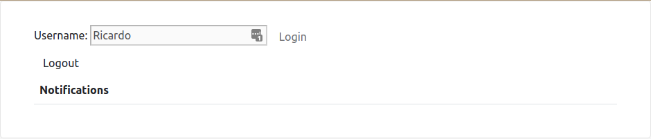
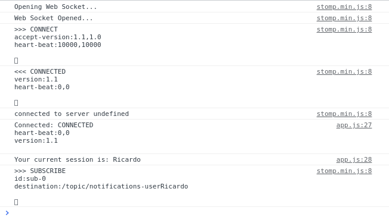
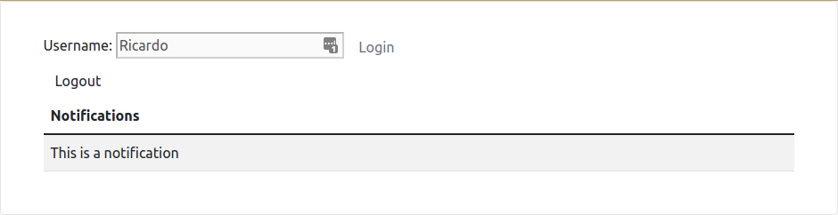

# Web Sockets Experiment
Testing Web sockets with Java

## Usage
Access `localhost:8085` for login and to be able to receive notifications



When logging in, the console shows how the javascript connects to the websocket:



While connected, a REST request can be sent to the backend in order to send a notification:
```
curl --location --request POST 'localhost:8085/api/notifications/submissions' \
--header 'Content-Type: application/json' \
--data-raw '{
"receiver": "Ricardo",
"text": "This is a notification"
}'
```

The notification appears in the page:


